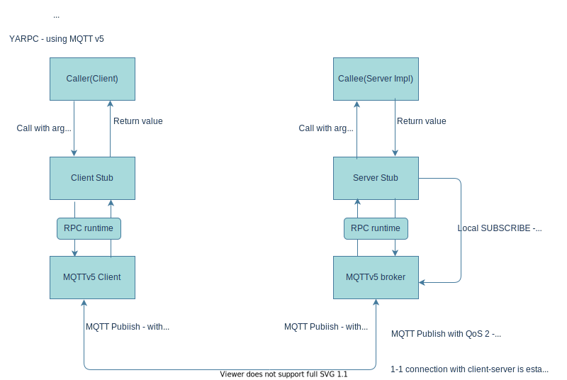

# yarpc.doc
Yet Another RPC system using MQTTv5  - Proof of Concept

The idea of developing another RPC system is conceived with the publication of MQTTv5.  The RPC system uses MQTTv5 as the transport.

Some characterstics of MQTT that enabled the decision
-----------------------------------------------------

1. MQTT is very light weight protocol that is being extensively used in IoT environments
2. MQTT follows a publish-subscribe pattern. This means, every message is being published/subscribed and uses a topic name for message identification. MQTTv5 opened up a possibility to use the protocol in a much more efficient or controlled way with the introduction of concepts such as topic aliases, user property, response topic etc... The RPC system will make use of these properties.
3. MQTT is network transport agnostic, i.e it can run on any medium that can support socket like operations, namely, TCP, WebSocket etc...
4. The existing brokers will not be used as it enables the possibility to subscribe to a topic by anyone. The broker implementation will be tailored to support 1-1 communication or in other words to support a request-response paradigm.
5. Will use QoS2 - Exactly once delivery

Goal
----
1. Support unary, bi-directional RPC calls
2. Usage of light weight transport for communication
3. Easy usage in browser environment, i.e the system should be easy to depoly/use without forcing any extra indrection or proxying.
4. Use the protobuf schema that the gRPC framework uses
5. Reconnect incase of network failures are enabled by default. i.e the system will automatically retry incase of network failures. note: RPC calls are bound by network connectivity, so automatic retry has it's own limitations.
6. Authentication, compression etc...

Proof of concept
----------------

1. Go (client/server side) and in typescript(client only to use in a browser env)
2. https://github.com/srishina/mqtt.ts & https://github.com/srishina/mqtt.go will be used for the MQTT implementation
2. Measure the network usage

Diagram
-------

